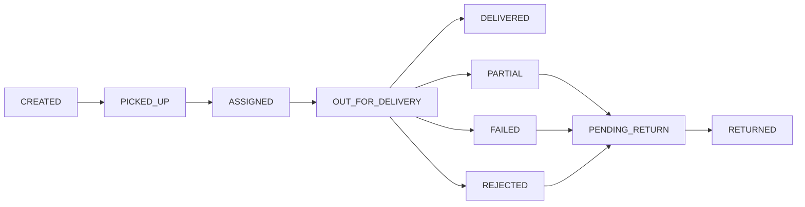

# Lotaya POS

**Internal COD delivery ERP** for Myanmar last-mile operations — pickup advances, rider dispatch, evening settlement, and a strict double-entry ledger.

English + Myanmar. Integer MMK only. Corrections via reversals, never silent edits.

```
  OS pickup ──► Hub advance ──► Rider delivery ──► Customer COD
       ▲              │                │                 │
       │              ▼                ▼                 ▼
  OS settlement   Ledger         Dispatch Queue      Rider app
                  (balanced)     Manifests / PDF     Outcomes
```

---

## What it is

Lotaya runs a **high-trust cash-on-delivery** shop: the company advances COD to Online Shops (OS) at pickup, riders collect COD and delivery fees from customers, then Finance settles riders and OS through wallets (Cash, KBZ Pay, Wave Pay).

The ERP is the operational and financial source of truth. Dispatchers and ops can correct parcel status from the web; riders only see their assigned work. Every money and status change is attributable, timestamped, and reversible.

**Phase 1 is internal.** Customer tracking, walk-in POS, GPS routing, and public OS portals are later phases.

---

## Three apps

| App | Who | Stack |
| --- | --- | --- |
| **ERP** (`frontend/`) | Superadmin, Ops, Dispatcher, Finance, Auditor | Vite, React, TypeScript, TanStack Query, shadcn/ui |
| **API** (`backend/`) | All clients | Express, Prisma, JWT · SQLite local · PostgreSQL production |
| **Rider** (`mobile/`) | Riders | Expo, Expo Router, React Native |

---

## Features

### Operations

- **All Batches** — one batch per OS + pickup date (label like `snmd 15.08.2026`). Remaining / delivered / pending-return counts, alerts.
- **Spreadsheet parcel entry** — paste or type rows; region first, then all townships in that region; district auto-fills. Delivery fees come from township master data.
- **Form entry** — one-parcel modal with Next (keep adding). Switch modes without losing the draft.
- **OS manifest PDF import** — local text extract only (no cloud OCR). Preview, then confirm into the grid. 10 MB / 50 pages / 500 rows.
- **Dispatch Queue** — dense POS-style table: OS Order ID first, tracking secondary. Multi-select, bulk assign, inline rider/status, Partial Return, link same-address parcels.
- **Manifests** — on-screen preview + PDF with embedded Myanmar font. Filter by rider, status, and **status activity date**.

### Parcel lifecycle



- Superadmin / Operations Manager / Dispatcher may set any status from Dispatch Queue (with history).
- Riders only post permitted delivery outcomes on **their** assigned parcels.
- Partial / Failed / Rejected require reason codes. Reschedule reasons raise **DATE_CHANGE** alerts.
- Partial Return requires **Actual COD Collected**; shortfall posts to the OS settlement path.
- Pending Return defaults to **four calendar days** (hub timezone); extensions are audited.
- Linked parcels at the same address: first parcel pays the township fee; each extra adds **1,000 MMK**. Commission uses the group fee only when **every** member is `DELIVERED`.

### Finance & ledger

- **Integer money** (MMK kyats). Balanced journals. Duplicate business events rejected.
- **Pickup advance** — one `BATCH_PICKUP_ADVANCE` per batch (re-post after reversal with a versioned source id).
- **Wallets** — Cash, KBZ Pay, Wave Pay. No single-sided transfers.
- **OS settlement** — draft → preview → post. COD coverage check. Returned / cancelled parcels contribute returned-advance. History + reversal.
- **OS pending returns** — Finance **Received** confirms return-to-OS (`FAILED` / `REJECTED` / `PENDING_RETURN` / `PARTIAL`) and stages recovery. Cash still moves on OS settlement, not on receive.
- **Rider settlement** — expected remittance  
  `COD + fees − commission − daily salary share`  
  Split across wallets. `DELIVERED` creates a **receivable**; it is **not** proof the hub already has the cash.
- **Cashbook day-close** — variance reason/approval, lock, Superadmin reopen with audit.
- **Guards** — `409 MONEY_POSTED` if you leave `DELIVERED`/`PARTIAL` while money journals are live; `409 ADVANCE_POSTED` if you edit COD/township after an unreversed batch advance.

### Riders

Pay model is **per rider**:

| Model | Compensation |
| --- | --- |
| `PERCENTAGE` | % of delivery fees on `DELIVERED` ways that day |
| `SALARY` | Monthly salary; daily `floor(salary / daysInMonth)` deducted at settlement; **no** commission |
| `SALARY_PLUS_PERCENTAGE` | Salary + percentage commission |

Failed / rejected / returned / partial ways earn **zero** commission.

**Rider app:** assigned list (OS Order ID first), township filter/sort, tap-to-call, outcomes with reasons, Partial Return actual COD, linked-group grouping, outstanding balance, English/Myanmar, light/dark.

### Identity & access

| Role | Typical work |
| --- | --- |
| Superadmin | Users, hubs, reversals, org-wide reports |
| Operations Manager | Batches, parcels, zones, exceptions, return extensions |
| Dispatcher | Import, assign, manifests, status corrections |
| Finance | Advances, OS/rider settlements, cashbook |
| Rider | Own assignments and allowed outcomes |
| Auditor | Read ledger, reports, history |

Login: **username or email** + password. Admin-created users (no public signup). Server-side authz, hub scope, rate-limited login. Password reset is admin-only today.

### Localization & UI

- English / Myanmar on ERP, API messages, and rider app.
- Light / dark / system themes.
- Myanmar text on dispatch PDFs (Noto Sans Myanmar).

---

## What Phase 1 does **not** include

Customer-facing tracking · payment gateways · live GPS / route optimization · sticker/barcode printing · payroll/tax · OS self-service portal · walk-in counter sales.

Those are later phases. Do not treat them as shipped.

---

## Repository

```
lotaya-pos/
├── backend/     Express API, Prisma, ledger, manifests
├── frontend/    Vite ERP
├── mobile/      Expo rider app
└── PROJECT_SPEC.md   Product source of truth
```

`PROJECT_SPEC.md` is authoritative for domain language, permissions, ledger rules, and acceptance criteria.

---

## Local development

Each app has its own `.env.example`. SQLite is the local/test database; PostgreSQL is production.

```bash
# API
cd backend && cp .env.example .env
npm install && npm run db:generate && npm run db:migrate
npm run provision:superadmin   # needs SUPERADMIN_* in .env
npm run dev                    # /api/v1

# ERP
cd frontend && cp .env.example .env
npm install && npm run dev

# Rider
cd mobile && cp .env.example .env
npm install && npx expo start
```

Useful scripts:

| Where | Command |
| --- | --- |
| backend | `npm test` · `npm run typecheck` · `npm run seed:locations` |
| frontend | `npm test` · `npm run typecheck` · `npm run build` |
| mobile | `npm test` · `npm run build:apk` |

---

## Design rules (money)

1. Never store money as floats.
2. Never edit a posted journal — reverse, then re-post.
3. Never infer “cash in the hub” from `DELIVERED`.
4. Never weaken authz, idempotency, or hub scope on the client.

---

## License

Private. All rights reserved.
