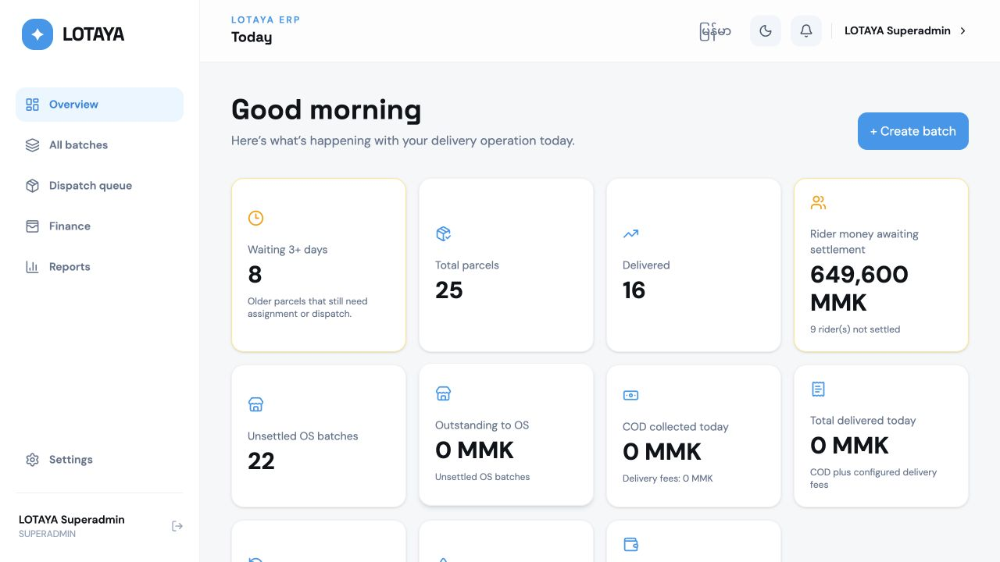
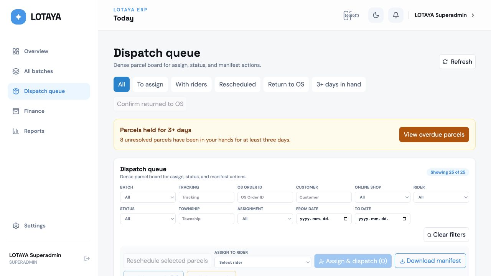
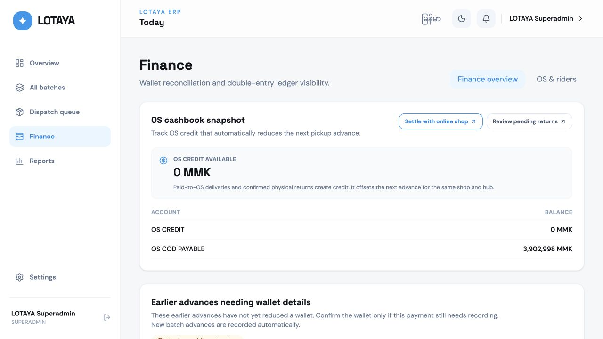
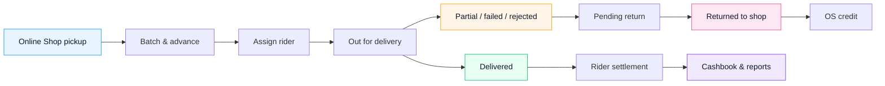

<div align="center">
  

  <h1>Delivery operations, dispatch, and finance—in one place.</h1>

  <p>
    Lotaya is an internal ERP and rider app for running a high-trust<br />
    cash-on-delivery delivery business in Myanmar.
  </p>

  <p>
    
    
    
    
    
    
  </p>
</div>

---

## What is Lotaya?

Lotaya helps a delivery team follow every parcel—and every kyat—from pickup to final settlement.

The business advances cash-on-delivery (COD) money to an Online Shop when parcels are collected. Riders then deliver those parcels, collect money from customers, and settle with the hub. Lotaya connects those operational steps to a strict double-entry ledger so Dispatch, Operations, Finance, and management see the same story.

In practical terms, the system answers questions such as:

- Which parcels still need a rider?
- What is physically with each rider right now?
- How much should a rider return at the end of the day?
- Which rejected parcels must go back to an Online Shop?
- How much does the company owe an Online Shop—or have available as credit?
- Which wallet actually received or paid the money?

> [!IMPORTANT]
> Lotaya is an **internal operations system**, not a public parcel-tracking or walk-in POS product. Customer tracking, live GPS routing, payment gateways, payroll, and an Online Shop self-service portal are outside Phase 1.

## A quick look

### Operations overview

Daily parcel counts, rider settlement exposure, OS balances, wallet positions, return queues, alerts, and net profit are visible at a glance.



### Dispatch queue

Dispatchers can search, filter, bulk-select, assign riders, correct statuses, reschedule deliveries, link same-address parcels, and generate manifests from one dense workspace.



### Finance workspace

Finance can reconcile Online Shop balances, rider collections, Cash, KBZ Pay, and Wave Pay while retaining balanced journals and a complete audit trail.



## How a parcel moves through Lotaya



Every status change records who made it, when it happened, and why. Financial corrections are made with reversals or compensating entries—never by silently rewriting posted history.

## What is included

| Area | What the team can do |
| --- | --- |
| **Batches & parcels** | Create one pickup batch per shop/date, paste parcel rows, import manifest PDFs, search by tracking number or OS Order ID, and review batch totals. |
| **Dispatch** | Bulk assign, record physical handover, reschedule, correct parcel outcomes, link same-address parcels, and export Myanmar-capable PDF manifests. |
| **Rider app** | View assigned work, filter by township, call customers, record delivery outcomes and reasons, and see the outstanding settlement amount. |
| **Returns** | Track failed, partial, rejected, and pending-return parcels with four-day timers, audited extensions, and return handover documents. |
| **Finance** | Record pickup advances, settle riders and Online Shops, move money between wallets, reverse mistakes, and close each cashbook day. |
| **Reports** | Review delivery activity, rider collections, OS accounts, ledger entries, profitability, and operational exceptions. |
| **Administration** | Manage hubs, shops, zones, riders, users, reason codes, pay models, permissions, language, and theme. |

### Roles

| Role | Main responsibility |
| --- | --- |
| **Superadmin** | Organization-wide configuration, users, reversals, and reports |
| **Operations Manager** | Batches, parcels, zones, exceptions, and return decisions |
| **Dispatcher** | Parcel entry, rider assignment, status correction, and manifests |
| **Finance** | Advances, rider/OS settlement, wallets, and day-close |
| **Rider** | Assigned parcels and permitted delivery outcomes only |
| **Auditor** | Read-only access to ledger, reports, and history |

Permissions are enforced by the API and scoped by hub. Hiding a button in the UI is not treated as authorization.

## The three applications

```text
lotaya-pos/
├── frontend/          Vite + React ERP for operations and finance
├── backend/           Express + Prisma API and accounting engine
├── mobile/            Expo / React Native rider application
├── deploy/            Production deployment and verification tools
└── PROJECT_SPEC.md    Product and domain source of truth
```

| Application | Technology | Default local address |
| --- | --- | --- |
| ERP web | React, TypeScript, Vite, TanStack Query, Tailwind | `http://localhost:5173` |
| API | Express, Prisma, JWT, SQLite locally / PostgreSQL in production | `http://localhost:4000/api/v1` |
| Rider | Expo, Expo Router, React Native, TanStack Query | Expo development server |

## Run it locally

### Prerequisites

- Node.js and npm
- A terminal for each application you want to run
- Android Studio, an Android device, or an iOS simulator only if you are working on the rider app

### 1. Start the API

```bash
cd backend
cp .env.example .env
npm install
npm run db:generate
npm run db:migrate
npm run seed:locations
```

Before provisioning the first administrator, set these values in `backend/.env`:

```dotenv
SUPERADMIN_NAME="Your name"
SUPERADMIN_USERNAME="admin"
SUPERADMIN_EMAIL="admin@example.com"
SUPERADMIN_PASSWORD="use-a-strong-password"
```

Then create that account and start the API:

```bash
npm run provision:superadmin
npm run dev
```

The local API uses SQLite by default, so PostgreSQL is not required for day-to-day development.

### 2. Start the ERP

In a second terminal:

```bash
cd frontend
cp .env.example .env
npm install
npm run dev
```

Open [http://localhost:5173](http://localhost:5173) and sign in with the administrator account you just created.

### 3. Start the rider app (optional)

In a third terminal:

```bash
cd mobile
cp .env.example .env
npm install
npx expo start
```

When testing on a physical phone, change the mobile API URL from `localhost` to the computer's LAN address so the phone can reach the API.

> [!TIP]
> A useful first tour is: **Settings → create a hub and Online Shop → create a rider → All batches → create a batch → add parcels → Dispatch queue → assign the rider**.

## Everyday workflow

1. **Configure the operation.** Create a hub, Online Shop, delivery zones, rider accounts, and reason codes.
2. **Receive a pickup.** Create a dated batch, record its advance split, and add or import its parcels.
3. **Dispatch the work.** Assign eligible parcels to riders and generate the daily manifest.
4. **Record outcomes.** Riders—or authorized ERP staff—record delivered, partial, failed, rejected, or return outcomes.
5. **Settle the money.** Finance compares expected rider remittance with Cash, KBZ Pay, and Wave Pay received.
6. **Close and review.** Settle Online Shop balances, close the cashbook day, and review reports and exceptions.

## Accounting rules worth knowing

- Money is stored as integer MMK values, never floating-point numbers.
- A normal `DELIVERED` event creates a rider receivable; it does **not** claim the cash is already in the hub.
- A paid-to-OS delivery creates Online Shop credit and no rider COD debt.
- Only successful deliveries earn percentage commission.
- Salary-bearing rider plans deduct a daily pro-rata salary share during settlement.
- Every journal must balance, and duplicate business events are rejected.
- Posted money is corrected by reversal and re-posting, not destructive editing.
- Cash, KBZ Pay, and Wave Pay are separate wallets; transfers always have two sides.

The full behavior, permissions, accounting vocabulary, and acceptance criteria live in [`PROJECT_SPEC.md`](PROJECT_SPEC.md).

## Quality checks

Run the checks for the area you changed:

```bash
# Backend
cd backend
npm test
npm run typecheck
npm run lint

# ERP
cd frontend
npm test
npm run typecheck
npm run build

# Rider
cd mobile
npm test
npm run typecheck
npm run lint
npm run doctor
```

Financial changes should also be verified against an isolated PostgreSQL database using [`backend/scripts/POSTGRES_TESTS.md`](backend/scripts/POSTGRES_TESTS.md).

## Releases and deployment

The ERP/API version is stored in [`VERSION`](VERSION), with release notes in [`CHANGELOG.md`](CHANGELOG.md). The Rider APK has an independent version in `mobile/app.json`, `mobile/package.json`, and `deploy/app/version.json`.

Production uses PostgreSQL behind TLS. The deployment process builds a versioned release, validates migrations, checks the database-backed readiness endpoint, switches the current release atomically, and restores application files if health checks fail. Database migrations remain forward-only, so production releases require a tested backup and restore plan.

Useful deployment checks:

```bash
bash deploy/test-deploy-contract.sh
bash deploy/test-release-domains.sh
bash deploy/test-rollback-release.sh
```

## Project status

Lotaya is a private internal product under active development. `PROJECT_SPEC.md` is authoritative; if implementation and documentation disagree, treat the specification as the source of truth and resolve the gap deliberately.

---

<div align="center">
  <strong>Built for clear handoffs, accountable money, and calmer delivery days.</strong><br />
  <sub>Private software · All rights reserved</sub>
</div>
